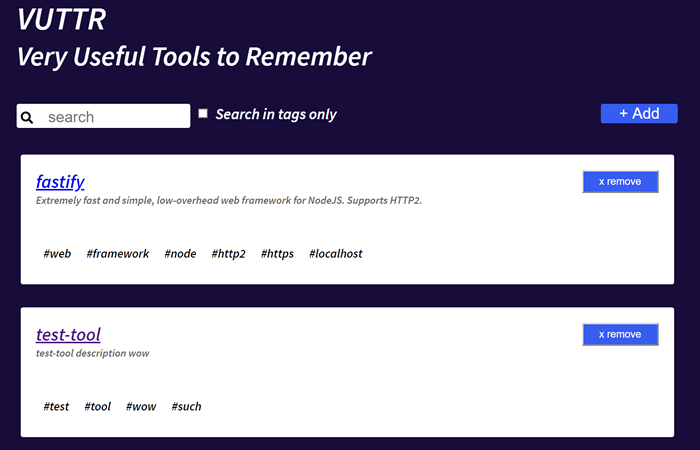

# Desafio Frontend - BossaBox

Neste desafio, foi feita uma aplicação ReactJS para consumir uma API de exemplo feita em Node. 

O desafio de Backend, que consiste em criar a mesma API, também foi feito, ele pode ser visto neste link:

https://github.com/dbins/bossabox_backend

## Instalação

- git clone
- npm install
- Iniciar a API digitando npm run api. 
- Na raiz do projeto, iniciar a aplicação digitando npm start
  

## Scripts incluídos nesta aplicação

### npm start

Para iniciar a aplicação em modo de desenvolvimento

### npm run build

Para gerar a versão em modo de produção, dentro da pasta Build localizada na raiz do projeto é criada a versão para colocar no ar.

### npm run test

Para testes unitários em modo de desenvolvimento. Para os testes é utilzada a biblioteca Enzyme

## Rotas da API

A documentação da API pode ser consultada na página api.html localizada na raiz do projeto. Abaixo segue um resumo das rotas disponíveis:

| Rota                    | Método | Descrição                 |
| ----------------------- | ------ | ------------------------- |
| /tools                  | GET    | Listar tools              |
| /tools?q=:busca         | GET    | Pesquisa tools pelo title |
| /tools?tags_like=:busca | GET    | Pesquisa tools por tag    |
| /tools                  | POST   | Criar uma nova tool       |
| /tools/:id              | DELETE | Apaga uma tool            |

Para ativar a API existem duas maneiras, a primeira é digita npm run api na raiz do projeto. A outra forma é acessar a pasta API e digitar o comando npx json-server db.json

A documentação fornecida pela BossaBox pode ser vista neste link:

https://gitlab.com/bossabox/challenge-fake-api/tree/master

## Testes

No terminal, a partir da raiz do projeto, digite npm run test para executar os testes da aplicação. Os testes foram feitos utilizado o Enzyme

## Documentação

A documentaçao dos componentes da aplicação se encontra no arquivo styleguide/index.html. Ela pode ser gerada de duas formas, digitando os seguintes comandos no terminal a partir da raiz da aplicação:

- npm run styleguide:build - Para gerar a versão HTML da documentação
- npm run styleguide - Para subir um servidor com a documentação

A documentação foi criada utilizada a biblioteca react-styleguidist

## DOCKER

Na raiz do projeto existe um arquivo Dockerfile com a configuração para criar um container para a aplicação e um arquivo docker-compose.yml para subir este container junto com outro container criado para subir a API de exemplo utilizada pela aplicação.

Os testes foram feitos no Windows 10. O passo a passo para subir o container é o seguinte:

- Abrir o programa "Kitematic (Alpha)"
- Dentro dele, na parte inferior esquerda, clicar em "Docker CLI". Será aberta uma janela de terminal do PowerShell.
- Acessar a pasta onde o projeto foi copiado
- Verifique qual o IP usado pelo docker usando o comando docker-machine ip default
- Alterar o arquivo .env na pasta do projeto e inserir o IP do docker, a variável de ambiente REACT_APP_API_URL guarda o IP da API fake.
- Subir os containers utilizando o comando docker-compose up
- Para acessar a aplicação, no navegador, digitar http://<IP_DO_DOCKER>:81.
- A API fake pode ser acessada pelo endereço digitar http://<IP_DO_DOCKER>:3000.

### Comandos úteis do Docker

-  docker ps - Para conferir os containers que estão em execução
-  docker-compose up --build - Para atualizar um container depois de editar o arquivo dockerfile ou docker-compose.yml
-  docker-machine start default - Para iniciar o serviço do docker, caso a inicialização será manual
-  docker-compose logs - Exibe os logs dos containers em execução
-  docker images - Lista as imagens cadastradas na máquina host
-  docker run <<nome do container>> - Inicia um container
-  docker stop <<nome do container>> - Encerra a execução de um container
-  docker stop $(docker ps -a -q)  - Encerra a execução de todos os container
-  docker rmi $(docker images -f “dangling=true” -q) - Exclui todos os container temporários (que possuem <None> no nome)
-  docker build - Cria um container a partir de um arquivo Dockerfile localizado na pasta onde o comando foi executado. Para iniciar vários containers ao mesmo tempo, utilize uma arquivo docker-compose.yml
-  docker volumes ls - Lista os volumes, que são as pastas compartilhadas usadas para persistir dados dos containers.
-  docker rm <<nome do container>> - Apaga um container
-  docker rmi <<nome da imagem>> - Apaga um container e a sua imagem
-  docker kill <<nome do container>> - Derruba o container informado
-  docker run -i -t <<nome do container>> /bin/bash - Acessa o terminal do container-
-  docker-compose up - Executar os containers informados no arquivo docker-compose.yml
-  docker-compose down - Encerra a execução dos containers iniciados pelo arquivo docker-compose.yml
 
